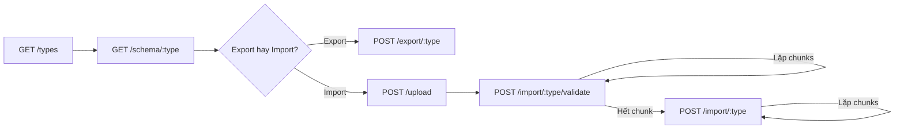

# Data Synchronize — FE Integration Guide

> **Base URL**: `{API_BASE}/v1/tools/data-synchronize`
>
> **Auth**: Tất cả endpoints yêu cầu `Authorization: Bearer {token}` header.
>
> **i18n**: Gửi `X-Locale: vi` hoặc `X-Locale: en` để nhận response dịch theo locale tương ứng.

---

## Mục lục

1. [Tổng quan Integration Flow](#1-tổng-quan-integration-flow)
2. [Discovery: Danh sách Types](#2-discovery-danh-sách-types)
3. [Schema: Metadata cho Form](#3-schema-metadata-cho-form)
4. [Export: Xuất dữ liệu](#4-export-xuất-dữ-liệu)
5. [Import Flow: Nhập dữ liệu](#5-import-flow-nhập-dữ-liệu)
6. [Error Handling](#6-error-handling)
7. [Permissions Matrix](#7-permissions-matrix)

---

## 1. Tổng quan Integration Flow

### URL Pattern (Uniform)

Tất cả routes dùng `{type}` parameter trực tiếp:

| Action | URL Pattern |
|---|---|
| Export | `POST /export/{type}` |
| Import | `POST /import/{type}` |
| Validate | `POST /import/{type}/validate` |
| Download Example | `POST /import/{type}/download-example` |
| Schema | `GET /schema/{type}` |
| List Types | `GET /types` |
| Upload | `POST /upload` |

**Available types**: `posts`, `pages`, `post-translations`, `page-translations`, `other-translations`

### Export Flow
```
FE load schema → User chọn columns/filters → POST /export/{type} → Download file
```

### Import Flow (3 bước)
```
1. Upload file     → POST /upload → nhận file_name
2. Validate file   → POST /import/{type}/validate → kiểm tra lỗi
3. Import data     → POST /import/{type} → xử lý import theo chunk
```



---

## 2. Discovery: Danh sách Types

### Request
```http
GET /v1/tools/data-synchronize/types
Authorization: Bearer {token}
X-Locale: vi
```

### Response `200 OK`
```json
{
  "data": [
    {
      "type": "posts",
      "label": "Bài viết",
      "total": 22,
      "export_description": "Xuất bài viết sang tệp CSV/Excel.",
      "import_description": "Nhập bài viết từ tệp CSV/Excel."
    },
    {
      "type": "pages",
      "label": "Trang",
      "total": 8,
      "export_description": "Xuất trang sang tệp CSV/Excel.",
      "import_description": "Nhập trang từ tệp CSV/Excel."
    }
  ]
}
```

---

## 3. Schema: Metadata cho Form

### Request
```http
GET /v1/tools/data-synchronize/schema/{type}
Authorization: Bearer {token}
```

`{type}` = `posts` | `pages` | `post-translations` | `page-translations` | `other-translations`

### Response `200 OK` — Ví dụ `schema/posts`
```json
{
  "data": {
    "type": "posts",
    "label": "Posts",
    "export": {
      "description": "Export posts to CSV/Excel file.",
      "total": 22,
      "columns": [
        { "key": "name", "label": "Name" },
        { "key": "description", "label": "Description" },
        { "key": "status", "label": "Status" }
      ],
      "filters": [
        { "key": "limit", "type": "number", "label": "Limit", "placeholder": "Leave empty to export all" },
        { "key": "status", "type": "select", "label": "Status", "options": [...] }
      ],
      "formats": ["csv", "xlsx"]
    },
    "import": {
      "description": "Import posts from a CSV/Excel file.",
      "chunk_size": 50,
      "columns": [
        { "key": "name", "label": "Name", "required": true, "rule_description": "..." }
      ],
      "examples": {
        "headers": ["Name", "Slug", ...],
        "rows": [{ "name": "Homepage", "slug": "homepage", ... }]
      },
      "formats": ["csv", "xlsx"]
    }
  }
}
```

---

## 4. Export: Xuất dữ liệu

### Request
```http
POST /v1/tools/data-synchronize/export/{type}
Authorization: Bearer {token}
Content-Type: application/json

{
  "format": "csv",
  "columns": ["name", "description", "status"],
  "status": "published",
  "limit": 100
}
```

### Response
Binary file download (CSV hoặc XLSX).

### FE Download
```js
async function exportData(type, params) {
  const response = await fetch(`${API_BASE}/v1/tools/data-synchronize/export/${type}`, {
    method: 'POST',
    headers: { 'Authorization': `Bearer ${token}`, 'Content-Type': 'application/json' },
    body: JSON.stringify(params),
  });
  const blob = await response.blob();
  const url = window.URL.createObjectURL(blob);
  const a = document.createElement('a');
  a.href = url;
  a.download = `export.${params.format || 'csv'}`;
  a.click();
  window.URL.revokeObjectURL(url);
}
```

---

## 5. Import Flow: Nhập dữ liệu

### Bước 0: Download file mẫu
```http
POST /v1/tools/data-synchronize/import/{type}/download-example
Content-Type: application/json
{ "format": "csv" }
```

### Bước 1: Upload file
```http
POST /v1/tools/data-synchronize/upload
Content-Type: multipart/form-data
file: (binary)
```
Response: `{ "data": { "file_name": "tmp_import_abc123.csv", ... } }`

### Bước 2: Validate (theo chunks)
```http
POST /v1/tools/data-synchronize/import/{type}/validate
{ "file_name": "tmp_import_abc123.csv", "offset": 0, "limit": 100, "total": null }
```
Response: `{ "data": { "offset": 100, "count": 100, "total": 250, "errors": [] } }`

### Bước 3: Import (theo chunks)
```http
POST /v1/tools/data-synchronize/import/{type}
{ "file_name": "tmp_import_abc123.csv", "offset": 0, "limit": 100 }
```
Response: `{ "data": { "offset": 100, "count": 100, "imported": 95, "failures": 5 } }`

### Complete Flow (FE)
```js
async function fullImportFlow(type, file) {
  // 1. Upload
  const formData = new FormData();
  formData.append('file', file);
  const upload = await api.post('/upload', formData);
  const fileName = upload.data.data.file_name;

  // 2. Validate loop
  let offset = 0, total = null, errors = [];
  while (true) {
    const res = await api.post(`/import/${type}/validate`, { file_name: fileName, offset, limit: 100, total });
    total = res.data.data.total;
    errors.push(...res.data.data.errors);
    if (res.data.data.offset >= total) break;
    offset = res.data.data.offset;
  }
  if (errors.length > 0) { showErrors(errors); return; }

  // 3. Import loop
  offset = 0;
  let imported = 0;
  while (offset < total) {
    const res = await api.post(`/import/${type}`, { file_name: fileName, offset, limit: 100 });
    imported += res.data.data.imported;
    if (res.data.data.count === 0) break;
    offset = res.data.data.offset;
  }
  showSuccess(`Imported ${imported} records`);
}
```

---

## 6. Error Handling

| HTTP Status | Ý nghĩa | FE xử lý |
|---|---|---|
| `401` | Chưa đăng nhập | Redirect login |
| `403` | Không có quyền | Hiển thị "Bạn không có quyền" |
| `404` | Type không tồn tại | Hiển thị lỗi |
| `422` | Validation error | Hiển thị lỗi từ `message` |
| `500` | Server error | Hiển thị "Lỗi hệ thống" |

---

## 7. Permissions Matrix

| Type | Export | Import |
|---|---|---|
| `posts` | `posts.export` | `posts.import` |
| `pages` | `pages.export` | `pages.import` |
| `post-translations` | `post-translations.export` | `post-translations.import` |
| `page-translations` | `page-translations.export` | `page-translations.import` |
| `other-translations` | `other-translations.export` | `other-translations.import` |

> Schema/types endpoints chỉ cần auth, không cần permission.
